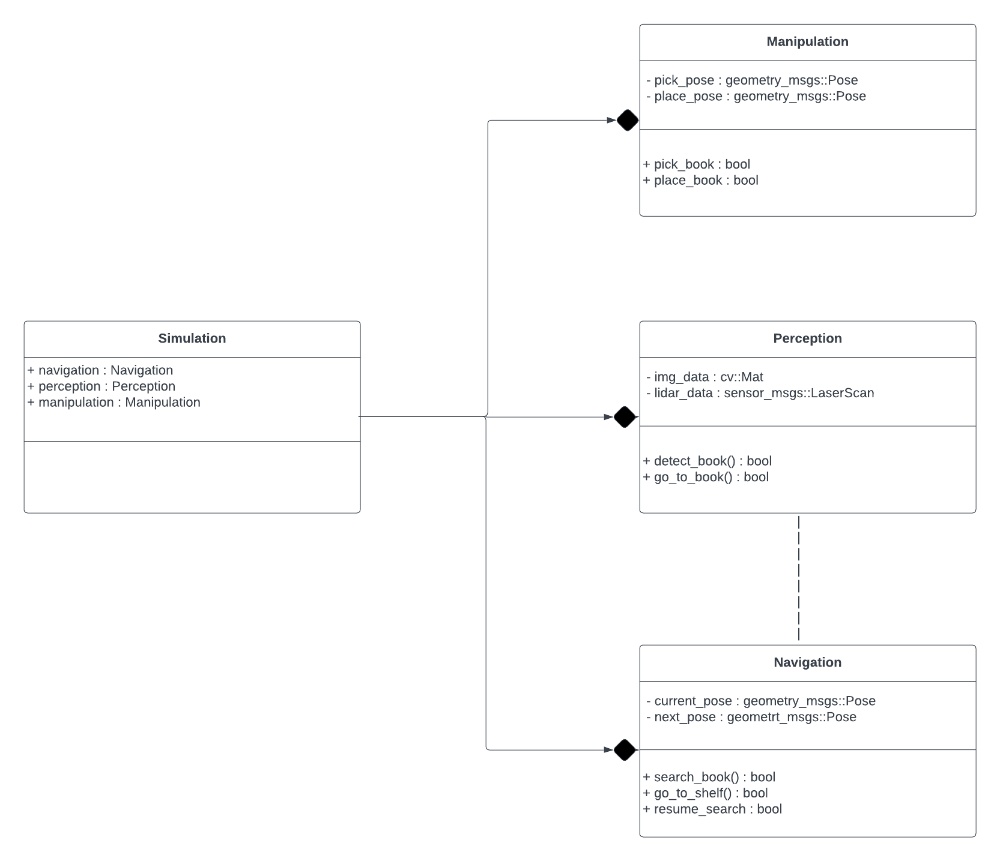

# 808x-final-project

## Problem Statement

Acme Robotics, Inc. is introducing an innovative mobile robot system for libraries, designed to address organizational challenges by autonomously collecting and organizing misplaced books. The company proposes a refined software development process, combining Agile Iterative Processes and pair-programming techniques over a three-week timeline. The robotic assistant navigates library spaces with precision, identifies and collects books from tables, and organizes them in designated shelves, enhancing efficiency. Acme envisions versatile applications beyond libraries, including retail inventory management, event cleanup, and home organization solutions, aiming to bring automation to diverse domains for increased efficiency and convenience.

## [License](LICENSE.md)

## Team Members

- [Kshitij Karnawat](github.com/KshitijKarnawat)
- [Hritvik Choudhari](github.com/Hritvik-Choudhari0411)
- [Ishan Kharat](github.com/IshanMahesh)

## Dependencies

- OpenCV 4.7.* or higher
- CMake 3.2 or higher
- Ubuntu 22.04
- GoogleTest (for testing)
- Doxygen
- Graphviz
- Cpplint
- CppCheck

## UML Diagrams

### Class Diagram



### Activity Diagram


### Quad Chart


## [Sprint Planning Sheet](https://docs.google.com/document/d/1JbbbAJ8IAPji8cDEJULXS9b06gbV5670XV5xcjyWHW8/edit?usp=sharing)

## [AIP Sheet](https://docs.google.com/spreadsheets/d/1mTLV-YEdRInJUX6wf7WwWbO4zYFp7oAwrzbesrukGaw/edit?usp=sharing)

## Build Instructions

### Build

```bash
cd <path to workspace>/src

# Clone the repository via HTTPS
git clone https://github.com/KshitijKarnawat/808x-final-project.git

# Clone the repository via SSH
git clone git@github.com:KshitijKarnawat/808x-final-project.git

cd ..

# Make sure you are in your workspace
# To build all the packages in the workspace
colcon build

# To build a specific package
colcon build --packages-select 808x-final-project
```

### Run

```bash
# Source the workspace
source <path to workspace>/install/setup.bash

# Run the program
```

### Test

```bash
# Source the workspace
source <path to workspace>/install/setup.bash

# Run the tests
ros2 run 808x-final-project test_808x-final-project
```

## Other Development Documentation

- [ROS2 Humble](https://docs.ros.org/en/humble/index.html)
- [OpenCV Documentation](https://opencv.org/)
- [Google Test Suite - 1](https://chromium.googlesource.com/external/github.com/google/googletest/+/refs/heads/v1.8.x/README.md)
- [Google Test Suite - 2](http://google.github.io/googletest/)

## Demos and Videos

### [Phase 1 Video](https://drive.google.com/drive/folders/1PNEZpoQxckXUty39gVZCyrosqI-xmcfu?usp=sharing)